# 🔥 Fire Intelligence Core

> **Production-Oriented Real-Time Fire & Smoke Intelligence Engine**

**Fire Intelligence Core** is a modular real-time computer-vision and incident-intelligence platform designed to transform raw visual detections into temporally stable signals, evaluate operational risk, manage incident lifecycles, and expose actionable intelligence through an API and operational dashboard.

The platform is engineered around a layered architecture that separates:

* Perception & Detection
* Confidence Filtering
* Object Tracking
* Temporal Smoothing
* Signal Fusion
* Risk Evaluation
* Incident Management
* Alert Routing
* Edge Runtime
* REST API Services
* Command Center Dashboard
* Security
* Observability
* Testing & Replay Validation

The architecture is designed to provide a foundation for intelligent fire-monitoring systems that can evolve from local development and single-camera operation toward distributed multi-camera deployments.

---

## 🧭 System Philosophy

Fire detection should not be treated as a single-frame classification problem.

A robust operational system needs to transform uncertain visual observations into stable, contextual, stateful decisions.

Fire Intelligence Core therefore follows the principle:

> **Perceive → Stabilize → Fuse → Assess → Decide → Respond**

The high-level architecture is:

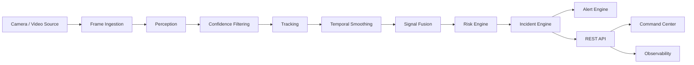

---

# 🎯 Objectives

The platform is built around several core objectives.

### Real-Time Perception

Convert incoming frames into structured fire and smoke detections using computer-vision inference models.

### Temporal Stability

Avoid treating every individual frame as an independent operational event.

Tracking, smoothing, confidence filtering, and hysteresis help distinguish persistent observations from transient noise.

### Risk-Aware Decision Making

Separate raw model confidence from operational risk.

The risk layer provides a dedicated location for confidence, persistence, severity, and contextual decision logic.

### Stateful Incident Management

Represent incidents as explicit entities with controlled lifecycle transitions instead of relying on simple boolean flags.

### Modular Architecture

Keep perception, inference, temporal processing, risk, incident management, API services, alerting, dashboard functionality, and observability independently organized.

### Operational Extensibility

Provide architectural boundaries that allow additional detectors, sensors, notification channels, edge runtimes, and operational integrations to be introduced without restructuring the entire system.

---

# 🧠 Intelligence Pipeline

The central processing pipeline is organized into multiple logical stages.

```mermaid
flowchart LR

    subgraph PERCEPTION["Perception"]
        A[Raw Frame]
        B[Fire / Smoke Detector]
        C[Raw Detection]
        A --> B
        B --> C
    end

    subgraph TEMPORAL["Temporal Intelligence"]
        D[Confidence Filter]
        E[ByteTrack]
        F[Track Manager]
        G[Temporal Smoothing]
        C --> D
        D --> E
        E --> F
        F --> G
    end

    subgraph INTELLIGENCE["Decision Intelligence"]
        H[Sensor / Signal Fusion]
        I[Risk Evaluation]
        J[Incident Engine]
        K[Incident Lifecycle]
        G --> H
        H --> I
        I --> J
        J --> K
    end

    subgraph RESPONSE["Operational Response"]
        L[Alert Engine]
        M[REST API]
        N[Dashboard]
        K --> L
        K --> M
        M --> N
    end
```

---

# 👁️ 1. Perception Layer

The `perception/` and `inference/` modules provide the computer-vision boundary of the system.

The architecture supports dedicated detector components for fire and smoke processing.

```text
Frame
  │
  ▼
Preprocessing
  │
  ▼
Detector Registry
  │
  ├── Fire Detector
  │
  └── Smoke Detector
  │
  ▼
Raw Detection
```

A detection can carry structured information such as:

```text
Detection
├── class
├── confidence
├── bounding box
├── timestamp
├── source
└── metadata
```

The separation between detection and downstream decision logic allows the perception subsystem to evolve independently from incident-management rules.

---

# 🎯 2. Detection & Inference

The inference layer contains dedicated components for:

* Detector registration
* Fire detection
* Smoke detection
* Frame preprocessing
* Model execution

Current repository assets include model formats such as:

```text
models/
├── fire_detector.pt
└── fire_smoke_v1.onnx
```

The repository also contains trained model artifacts under the training and validation outputs.

Model artifacts should be treated as deployable assets rather than hard-coded business logic.

---

# 🛡️ 3. Confidence Filtering

Computer-vision models produce probabilistic observations.

The platform therefore provides a confidence-processing stage before observations are allowed to influence downstream intelligence.

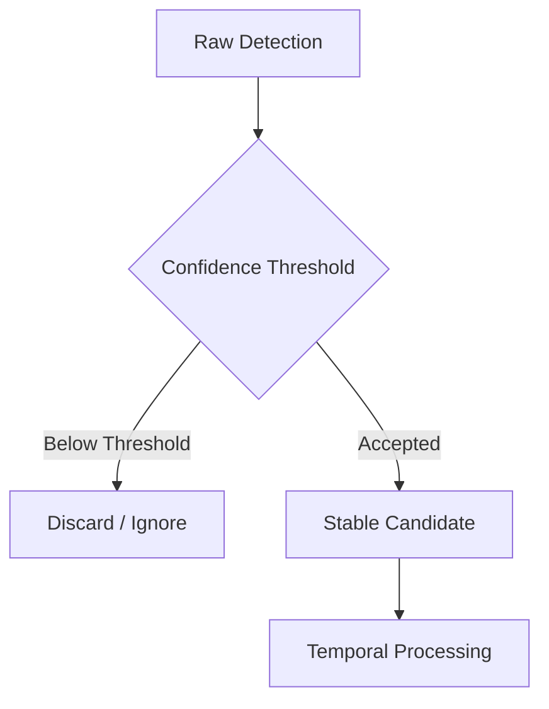

This prevents weak observations from automatically becoming operational incidents.

---

# 🎥 4. Tracking

The temporal subsystem includes:

```text
temporal/
├── smoothing/
│   ├── confidence_filter.py
│   └── temporal_smoothing.py
│
└── tracking/
    ├── bytetrack.py
    └── track_manager.py
```

Tracking provides identity continuity across frames and establishes the foundation for persistence-aware reasoning.

Conceptually:

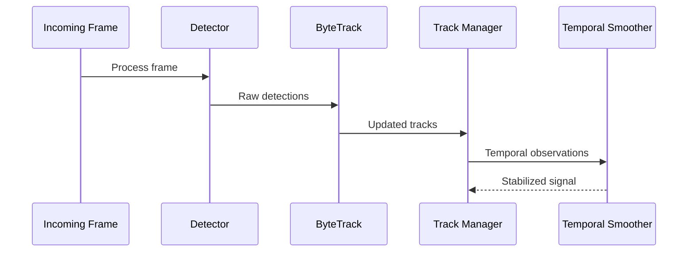

---

# ⏱️ 5. Temporal Smoothing & Hysteresis

A single detection is not necessarily sufficient to establish a persistent event.

The temporal layer introduces smoothing and hysteresis to reduce instability caused by intermittent model predictions.

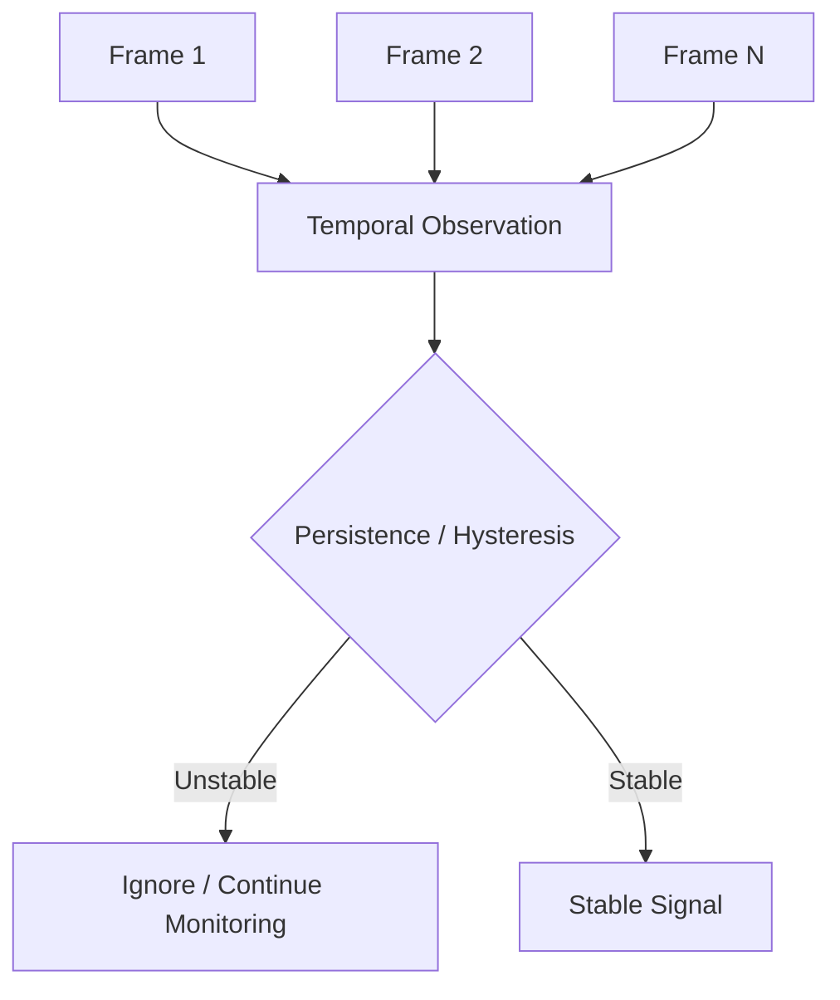

This layer is particularly important for reducing event oscillation between positive and negative states.

---

# 🔗 6. Signal Fusion

The `fusion/` subsystem provides an abstraction for combining information from multiple signals.

```text
fusion/
├── fusion_engine.py
└── sensor_state.py
```

The architectural boundary allows the intelligence layer to reason about multiple evidence sources rather than treating one detector output as an absolute truth.

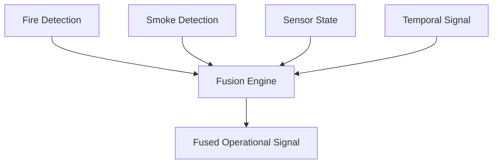

The current architecture provides the fusion boundary; additional sensor adapters can be integrated through this layer as the platform evolves.

---

# ⚠️ 7. Risk Intelligence

Detection confidence and operational risk are different concepts.

The `risk/` subsystem provides a dedicated decision layer:

```text
risk/
├── confidence.py
├── risk_engine.py
└── severity.py
```

The conceptual flow is:

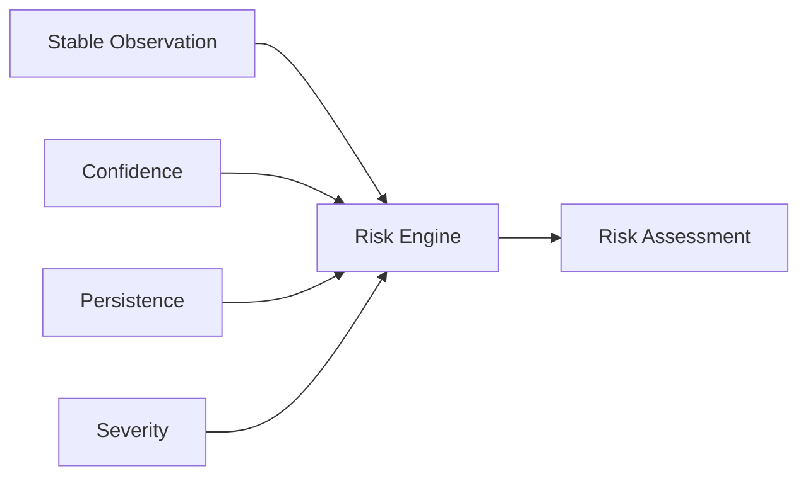

The resulting risk assessment becomes an input to incident management.

---

# 🚒 8. Incident Intelligence

Incidents are represented as stateful objects rather than simple flags.

The incident subsystem contains:

```text
incidents/
├── incident_engine.py
├── incident_lifecycle.py
└── incident_state.py
```

The lifecycle is governed by explicit state-transition logic.

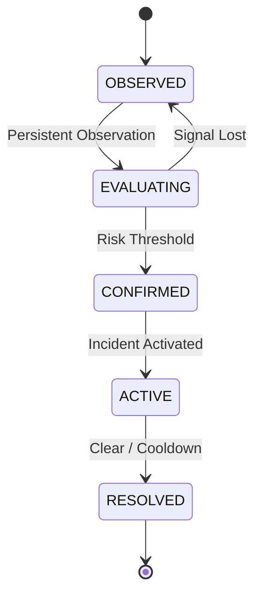

This approach provides deterministic lifecycle management and prevents arbitrary state changes.

The repository includes automated validation for both valid and invalid state transitions.

---

# 📡 9. Alert Engine

The alert subsystem is intentionally separated from the incident engine.

```text
alerts/
├── alert_engine.py
└── channels/
    ├── telegram.py
    └── whatsapp.py
```

Conceptually:

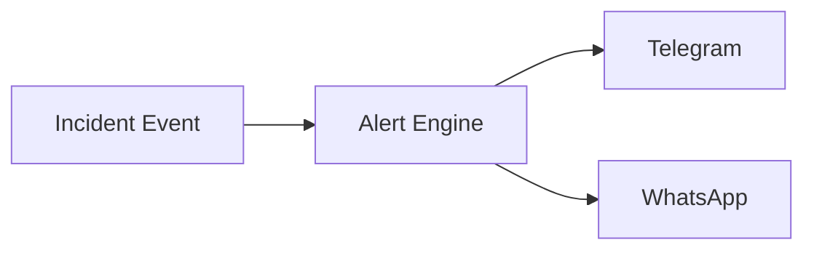

This decoupling allows notification channels to evolve without coupling notification implementation to the incident state machine.

---

# 🌐 10. REST API

The API boundary is implemented using FastAPI.

The API is organized around:

```text
api/
├── middleware/
├── routes/
├── schemas/
├── services/
├── config.py
└── main.py
```

Available route areas include:

```text
GET  /health
GET  /cameras
POST /detections/ingest
GET  /incidents
```

The exact available endpoints should be treated as the source of truth in the running OpenAPI specification.

---

## Detection Ingestion Flow

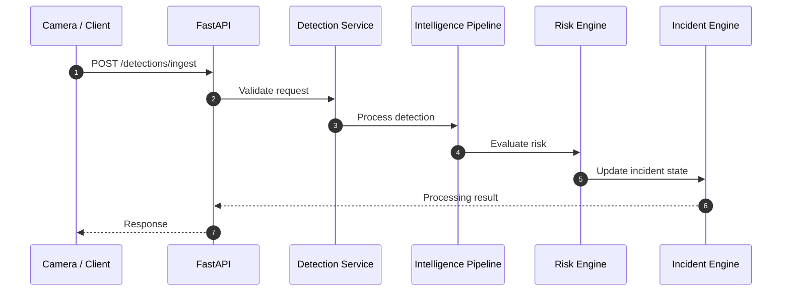

---

# 🖥️ 11. Command Center Dashboard

The `dashboard/` subsystem provides an operational interface.

```text
dashboard/
├── assets/
├── components/
├── pages/
├── services/
├── app.py
├── config.py
└── __init__.py
```

The dashboard is organized around operational concerns such as:

* Live monitoring
* Incident visibility
* Camera views
* Alerts
* Metrics
* System health
* Command-center workflows

Conceptual architecture:

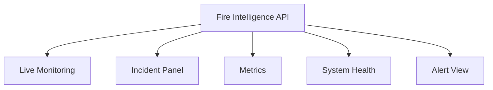

---

# 📹 12. Edge Runtime

The platform includes an edge-oriented architecture:

```text
edge/
├── camera_agent/
│   ├── frame_buffer.py
│   ├── health.py
│   └── rtsp.py
│
└── edge_runtime/
    ├── pipeline.py
    └── runtime.py
```

The edge layer provides architectural boundaries for:

* RTSP camera streams
* Frame buffering
* Camera health
* Edge processing
* Runtime execution

Conceptually:

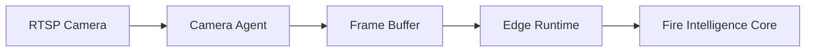

---

# 🔐 13. Security

Security is isolated under:

```text
security/
├── audit.py
├── authentication.py
└── schemas.py
```

This provides a dedicated location for:

* Authentication
* Security schemas
* Audit-related functionality

The separation is intentional so security concerns remain independent from perception and decision logic.

---

# 📊 14. Observability

The platform includes an observability subsystem:

```text
observability/
├── logging.py
├── metrics.py
└── tracing.py
```

The architectural goal is to make system behavior measurable across:

* Request timing
* Processing performance
* Metrics
* Logs
* Traces

This becomes increasingly important as the system moves from local execution toward distributed deployment.

---

# 🧪 Testing Strategy

Testing is treated as a first-class engineering component.

The repository contains:

```text
tests/
├── e2e/
├── integration/
├── performance/
├── replay/
└── unit/
```

The testing strategy covers multiple levels.

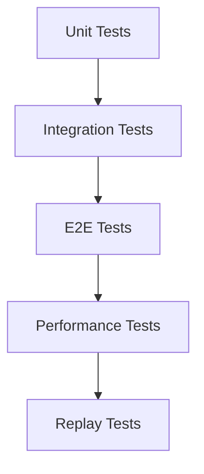

---

# ✅ Automated Test Validation

The current full test suite has been executed successfully:

```text
8 passed
```

Covered areas include:

* API health check
* End-to-end detection ingestion
* Incident flow
* Valid incident state transitions
* Invalid incident state transitions
* Raw detection creation
* Risk engine calculation
* Temporal smoothing / hysteresis

Example command:

```bash
python -m pytest tests -v
```

---

# ⚡ Performance Validation

Performance is measured through dedicated benchmark suites rather than relying exclusively on unit-test execution time.

Available benchmarks:

```text
tests/performance/
├── benchmark_baseline.py
└── benchmark_concurrent.py
```

---

## Baseline API Benchmark

A 50-request sequential baseline run produced:

```text
Total Frames Attempted : 50
Successful Requests    : 50
Failed Requests        : 0

Success Rate           : 100%

Throughput             : 7.93 req/sec

Average Latency        : 101.72 ms
P50 Latency             : 87.60 ms
P95 Latency             : 176.80 ms
P99 Latency             : 296.81 ms

Maximum Latency        : 382.16 ms
```

These values represent the recorded benchmark environment and should not be interpreted as universal hardware-independent performance guarantees.

---

# 🔥 Concurrency Benchmark

The production concurrency benchmark was executed across four scenarios.

| Scenario         | Cameras | Requests | Success Rate |  Throughput | Avg Latency |        P95 |        P99 |
| ---------------- | ------: | -------: | -----------: | ----------: | ----------: | ---------: | ---------: |
| Baseline         |       1 |       50 |         100% |  4.11 req/s |   233.60 ms |  648.89 ms | 1013.58 ms |
| Multi-Camera     |       5 |      100 |         100% | 21.00 req/s |   206.84 ms |  303.83 ms |  499.27 ms |
| High Concurrency |      10 |      200 |         100% | 15.67 req/s |   476.55 ms | 1262.54 ms | 3175.20 ms |
| Stress           |      20 |      400 |         100% | 15.07 req/s |  1106.71 ms | 3048.47 ms | 4484.58 ms |

All 750 benchmark requests across these scenarios completed successfully.

> **Important:** Throughput and latency are workload- and environment-dependent. These results are benchmark observations, not production capacity guarantees.

---

# 🔁 Replay Validation

The repository provides two replay paths:

```text
tests/replay/
├── run_replay.py
└── run_replay_fast.py
```

The optimized replay path recorded:

```text
Total Frames Processed       : 50
Average Pipeline Latency     : 460.33 ms
Effective Throughput         : 16.4 FPS
```

The full replay path recorded:

```text
Total Frames Processed       : 50
Average Pipeline Latency     : 2161.39 ms
Effective Throughput         : 0.5 FPS
Incidents Triggered          : 23
```

The two replay modes represent different execution paths and should therefore be interpreted separately rather than treated as interchangeable performance measurements.

---

# 📈 Performance Interpretation

The benchmarks demonstrate several useful characteristics:

### API Reliability

The tested concurrency scenarios achieved:

```text
100% request success rate
```

including the 20-camera stress scenario.

### Latency Distribution

The baseline API path operates primarily in the low-hundreds-of-milliseconds range in the recorded environment.

### Concurrency Behavior

The system successfully processed the tested concurrent workloads without request failures.

### Full-Pipeline Cost

The replay benchmark demonstrates that full pipeline execution can be substantially more computationally expensive than the optimized replay path.

This distinction is important for future capacity planning and deployment optimization.

---

# 🏗️ Complete Architecture

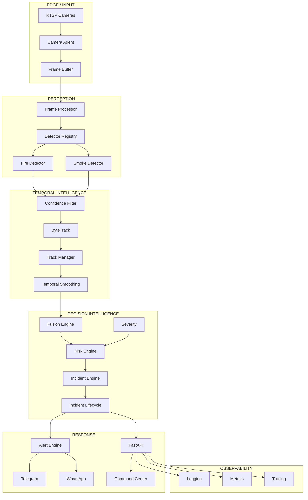

---

# 🧩 Repository Structure

```text
fire-intelligence-core/
│
├── alerts/
│   ├── channels/
│   │   ├── telegram.py
│   │   └── whatsapp.py
│   └── alert_engine.py
│
├── api/
│   ├── middleware/
│   │   └── request_timing.py
│   ├── routes/
│   │   ├── cameras.py
│   │   ├── detections.py
│   │   ├── health.py
│   │   └── incidents.py
│   ├── schemas/
│   │   ├── detection.py
│   │   └── incident.py
│   ├── services/
│   │   ├── fire_detector.py
│   │   ├── telegram_service.py
│   │   └── whatsapp_service.py
│   ├── config.py
│   ├── main.py
│   └── __init__.py
│
├── configs/
│   ├── settings.py
│   └── __init__.py
│
├── dashboard/
│   ├── assets/
│   ├── components/
│   │   ├── alerts.py
│   │   ├── camera_view.py
│   │   ├── incident_panel.py
│   │   └── metrics.py
│   ├── pages/
│   │   ├── command_center.py
│   │   ├── incidents.py
│   │   ├── live_monitoring.py
│   │   └── system_health.py
│   ├── services/
│   │   ├── alarm_service.py
│   │   ├── api_client.py
│   │   ├── camera_service.py
│   │   └── fire_detector.py
│   ├── app.py
│   ├── config.py
│   └── __init__.py
│
├── edge/
│   ├── camera_agent/
│   │   ├── frame_buffer.py
│   │   ├── health.py
│   │   └── rtsp.py
│   └── edge_runtime/
│       ├── pipeline.py
│       └── runtime.py
│
├── fusion/
│   ├── fusion_engine.py
│   └── sensor_state.py
│
├── incidents/
│   ├── incident_engine.py
│   ├── incident_lifecycle.py
│   └── incident_state.py
│
├── inference/
│   ├── detection/
│   │   ├── detector_registry.py
│   │   ├── fire_detector.py
│   │   └── smoke_detector.py
│   └── preprocessing/
│       └── frame_processor.py
│
├── models/
│   ├── fire_detector.pt
│   └── fire_smoke_v1.onnx
│
├── observability/
│   ├── logging.py
│   ├── metrics.py
│   └── tracing.py
│
├── perception/
│   └── fire_detector.py
│
├── risk/
│   ├── confidence.py
│   ├── risk_engine.py
│   └── severity.py
│
├── security/
│   ├── audit.py
│   ├── authentication.py
│   └── schemas.py
│
├── shared/
│   ├── enums.py
│   ├── exceptions.py
│   └── schemas.py
│
├── temporal/
│   ├── smoothing/
│   │   ├── confidence_filter.py
│   │   └── temporal_smoothing.py
│   └── tracking/
│       ├── bytetrack.py
│       ├── track_manager.py
│       └── __init__.py
│
├── tests/
│   ├── e2e/
│   │   └── test_api_e2e.py
│   ├── integration/
│   │   └── test_pipeline_integration.py
│   ├── performance/
│   │   ├── benchmark_baseline.py
│   │   └── benchmark_concurrent.py
│   ├── replay/
│   │   ├── run_replay.py
│   │   └── run_replay_fast.py
│   └── unit/
│       ├── incidents/
│       ├── perception/
│       ├── risk/
│       └── temporal/
│
├── weights/
│
├── configs/
│
├── Dockerfile
├── docker-compose.yml
├── main.py
├── pyproject.toml
├── requirements.txt
├── .env.example
├── .gitignore
└── README.md
```

---

# 🐳 Containerization

The repository includes Docker support:

```text
Dockerfile
docker-compose.yml
```

Build the image:

```bash
docker build -t fire-intelligence-core .
```

Run with Docker Compose:

```bash
docker compose up --build
```

The exact services and runtime configuration are defined by the repository's `docker-compose.yml`.

---

# 🚀 Getting Started

## 1. Clone

```bash
git clone <repository-url>
cd fire-intelligence-core
```

---

## 2. Create Virtual Environment

### Windows

```powershell
python -m venv .venv
.venv\Scripts\activate
```

### Linux / macOS

```bash
python3 -m venv .venv
source .venv/bin/activate
```

---

## 3. Install Dependencies

```bash
pip install -r requirements.txt
```

---

## 4. Configure Environment

### Windows

```powershell
copy .env.example .env
```

### Linux / macOS

```bash
cp .env.example .env
```

Review the generated `.env` file before running the platform.

---

# ▶️ Running the System

Start the main application:

```bash
python main.py
```

Or run the API directly through Uvicorn:

```bash
uvicorn api.main:app --reload --port 8000
```

The API is expected to be available at:

```text
http://127.0.0.1:8000
```

---

# 🧪 Running Tests

Run the complete automated test suite:

```bash
python -m pytest tests -v
```

Expected result for the validated repository state:

```text
8 passed
```

---

# ⚡ Running Performance Tests

## Baseline

```bash
python -m tests.performance.benchmark_baseline
```

## Concurrent Cameras

```bash
python -m tests.performance.benchmark_concurrent
```

---

# 🔁 Running Replay Validation

Optimized replay:

```bash
python tests/replay/run_replay_fast.py
```

Full replay:

```bash
python tests/replay/run_replay.py
```

---

# 🔍 API Validation

The project includes E2E validation for:

* Health endpoint
* Detection ingestion
* Incident flow

Run:

```bash
python -m pytest tests/e2e/test_api_e2e.py -v
```

---

# 📋 Engineering Validation Matrix

| Area                   | Validation |
| ---------------------- | ---------- |
| Unit Logic             | ✅          |
| Incident FSM           | ✅          |
| Detection Creation     | ✅          |
| Risk Engine            | ✅          |
| Temporal Smoothing     | ✅          |
| Integration Pipeline   | ✅          |
| API Health             | ✅          |
| API Detection Flow     | ✅          |
| End-to-End Flow        | ✅          |
| Sequential Performance | ✅          |
| Concurrent Performance | ✅          |
| Replay Execution       | ✅          |
| Docker Assets          | Present    |
| Security Module        | Present    |
| Observability Module   | Present    |
| Edge Architecture      | Present    |
| Dashboard Architecture | Present    |

---

# 📐 Design Principles

## Separation of Concerns

Each major responsibility is isolated into its own subsystem.

```text
Perception
    ↓
Temporal
    ↓
Fusion
    ↓
Risk
    ↓
Incidents
    ↓
Alerts / API
```

---

## Stateful Intelligence

The system does not rely exclusively on frame-level decisions.

It maintains state across observations.

---

## Modular Detection

Detectors are separated from business logic, allowing models and inference strategies to evolve independently.

---

## Explicit Incident Lifecycle

Incident state transitions are validated rather than implicitly changed throughout the application.

---

## API Boundary

External clients interact through a dedicated API layer instead of directly coupling to internal intelligence modules.

---

## Observable Execution

Logging, metrics, tracing, and request timing are treated as part of the system architecture rather than optional debugging utilities.

---

# 🧱 Architectural Layers

```text
┌─────────────────────────────────────────────┐
│           Operational Interfaces            │
│       Dashboard / Alerts / API Clients      │
├─────────────────────────────────────────────┤
│             Incident Intelligence           │
│          Lifecycle / State Management       │
├─────────────────────────────────────────────┤
│               Risk Intelligence             │
│       Confidence / Severity / Risk          │
├─────────────────────────────────────────────┤
│              Signal Intelligence            │
│           Fusion / Sensor State             │
├─────────────────────────────────────────────┤
│             Temporal Intelligence           │
│       Tracking / Smoothing / Filtering      │
├─────────────────────────────────────────────┤
│                Perception                   │
│       Detection / Preprocessing / Models    │
├─────────────────────────────────────────────┤
│                Edge / Input                 │
│        Cameras / RTSP / Frame Buffer        │
├─────────────────────────────────────────────┤
│          Infrastructure & Security          │
│      Observability / Authentication         │
└─────────────────────────────────────────────┘
```

---

# 🔬 Validation Philosophy

Performance and correctness are evaluated independently.

A system can have:

* correct logic but insufficient throughput,
* high throughput but unstable decisions,
* reliable API behavior but expensive inference,
* accurate detection but poor temporal stability.

Fire Intelligence Core therefore validates the platform across multiple dimensions rather than reducing system quality to one benchmark number.

---

# 🛣️ Evolution Path

The current architecture provides a foundation for future development in areas such as:

### Distributed Camera Processing

Expand from local execution toward distributed camera fleets.

### Edge Optimization

Move computationally expensive inference closer to the camera when appropriate.

### Model Optimization

Explore optimized inference runtimes and model quantization for deployment-specific hardware.

### Multi-Sensor Integration

Extend the fusion architecture with additional physical and environmental sensor adapters.

### Production Observability

Expand metrics, traces, dashboards, alerting policies, and operational SLO monitoring.

### Scalable Event Infrastructure

Introduce durable event transport and distributed processing where deployment scale requires it.

### Advanced Incident Intelligence

Extend incident reasoning with richer contextual, spatial, and temporal evidence.

### Automated Model Lifecycle

Introduce model versioning, evaluation, deployment, rollback, and monitoring workflows.

---

# ⚠️ Operational Notes

Fire Intelligence Core is a software intelligence platform and should not be treated as a standalone replacement for certified fire-safety infrastructure, emergency procedures, or regulatory systems.

Computer-vision predictions are probabilistic.

Real-world deployment should therefore include:

* Appropriate camera placement
* Environmental validation
* Model evaluation against representative data
* False-positive / false-negative analysis
* Hardware capacity testing
* Network reliability testing
* Operational alert validation
* Fail-safe procedures
* Human oversight where required
* Compliance with applicable fire-safety regulations

Benchmark numbers in this README describe the tested development environment and workload only.

They should not be interpreted as guaranteed production capacity.

---

# 📊 Current Validation Snapshot

```text
Automated Tests
────────────────────────────────────
8 / 8 PASSED

Concurrent API Validation
────────────────────────────────────
400 / 400 successful requests
100% success rate

Sequential API Baseline
────────────────────────────────────
50 / 50 successful requests
100% success rate
7.93 req/sec
101.72 ms average latency

Optimized Replay
────────────────────────────────────
50 frames
16.4 FPS
460.33 ms average pipeline latency

Full Replay
────────────────────────────────────
50 frames
0.5 FPS
2161.39 ms average pipeline latency
23 incidents triggered
```

---

# 🏆 What This Project Demonstrates

Fire Intelligence Core demonstrates the engineering pattern required to transform computer-vision predictions into an operational intelligence system.

It combines:

```text
Computer Vision
      +
Temporal Reasoning
      +
Object Tracking
      +
Signal Fusion
      +
Risk Evaluation
      +
State Machines
      +
Incident Management
      +
Alerting
      +
REST APIs
      +
Edge Architecture
      +
Observability
      +
Automated Testing
```

The result is not simply a fire detector.

It is an architectural foundation for a **stateful fire-intelligence system**.

---

# 📚 Documentation

Additional technical documentation is organized under:

```text
docs/
├── api.md
├── architecture.md
└── pipeline.md
```

These documents provide deeper technical context for API behavior, architecture, and pipeline design.

---

# 🤝 Development Workflow

A recommended engineering workflow is:

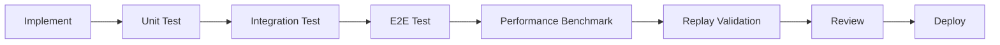

Every significant architectural change should be validated at the appropriate testing level.

---

# 🔐 Configuration & Secrets

Runtime configuration should be supplied through environment variables.

Do not commit real credentials, API keys, tokens, or production secrets into the repository.

Use:

```text
.env.example
```

as the configuration template.

---

# 📦 Model Artifacts

The repository contains trained model artifacts and inference assets.

Examples include:

```text
models/
├── fire_detector.pt
└── fire_smoke_v1.onnx
```

Large model artifacts should be managed according to the deployment and source-control strategy used by the project.

---

# 🧭 Project Status

**Current status: Functional production-oriented core with automated validation, API integration, replay testing, concurrency benchmarking, edge architecture, alerting, dashboard structure, security boundaries, and observability foundations.**

The repository has successfully demonstrated:

* Automated test execution
* API-level E2E execution
* Detection ingestion
* Incident lifecycle processing
* Sequential API benchmarking
* Concurrent multi-camera request handling
* Replay execution
* Modular subsystem boundaries

Further optimization and production-hardening remain part of the platform's natural evolution toward larger distributed deployments.

---

# 🔥 Final Architecture Principle

```text
                    FIRE INTELLIGENCE CORE

                         ┌───────────┐
                         │  CAMERA   │
                         └─────┬─────┘
                               │
                               ▼
                       ┌───────────────┐
                       │   PERCEPTION  │
                       └───────┬───────┘
                               │
                               ▼
                       ┌───────────────┐
                       │    TEMPORAL   │
                       │ Tracking /    │
                       │ Smoothing     │
                       └───────┬───────┘
                               │
                               ▼
                       ┌───────────────┐
                       │    FUSION     │
                       └───────┬───────┘
                               │
                               ▼
                       ┌───────────────┐
                       │     RISK      │
                       └───────┬───────┘
                               │
                               ▼
                       ┌───────────────┐
                       │   INCIDENT    │
                       │     FSM       │
                       └───────┬───────┘
                               │
                    ┌──────────┴──────────┐
                    ▼                     ▼
             ┌─────────────┐       ┌─────────────┐
             │   ALERTS    │       │     API     │
             └─────────────┘       └──────┬──────┘
                                          │
                                          ▼
                                   ┌─────────────┐
                                   │  DASHBOARD  │
                                   └─────────────┘
```

---

# 🔥 Fire Intelligence Core

### **Perceive. Stabilize. Fuse. Assess. Decide. Respond.**

A modular foundation for building intelligent, stateful, real-time fire-monitoring systems.
